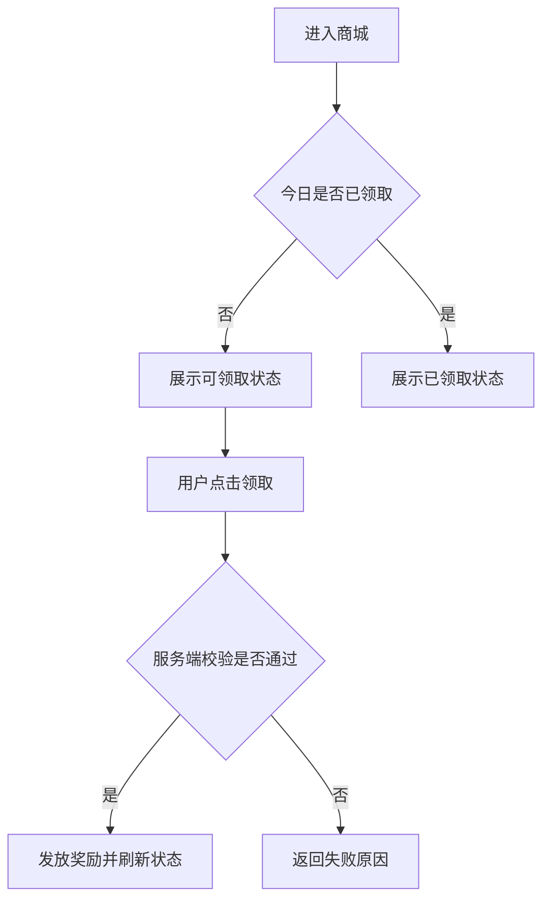
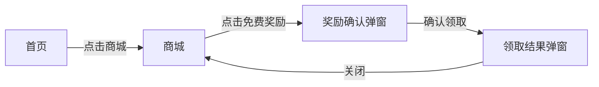
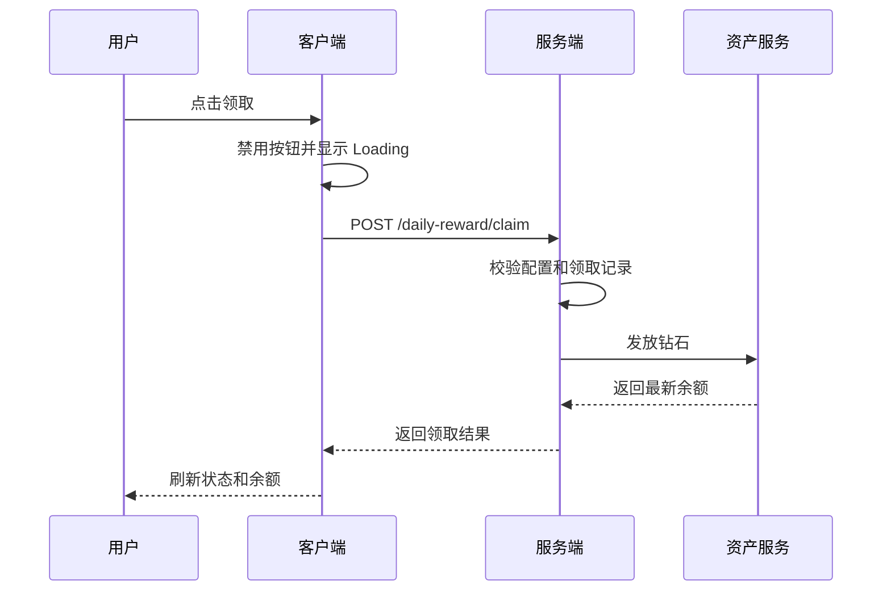
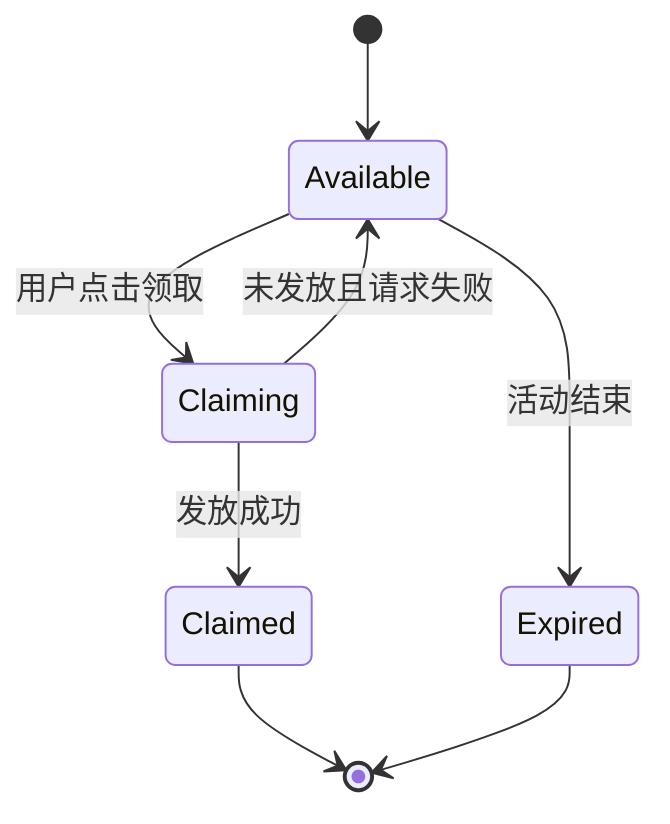
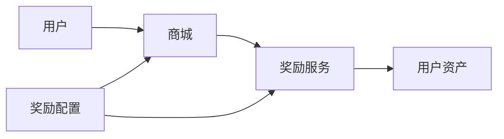
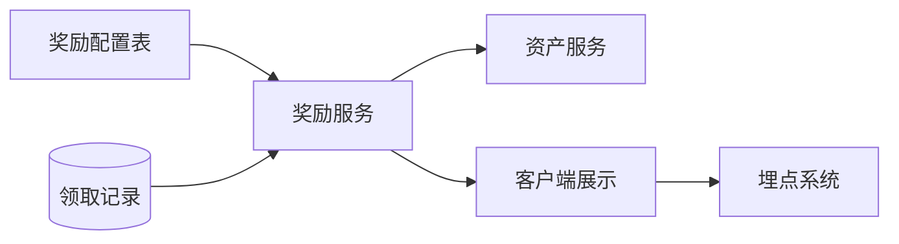

# PRD 图形规范

仅当文字难以清楚表达时读取本规范。每张图只解决一种问题，不能代替功能规则、接口字段、配置说明或验收标准。

## 1. 用户业务流程图

用途：说明入口、操作、判断、成功和失败结果。

触发：超过 3 个步骤，或存在条件分支、成功/失败路径。

要求：从明确入口开始，到明确结果结束；判断节点使用可回答的问题；分支标明条件；不塞入全部接口字段和数据库细节。

## 2. 页面流转图

用途：说明页面、弹窗、返回和中断恢复关系。

触发：涉及 2 个以上页面/弹窗，或返回关系不直观。

要求：节点只表示页面、弹窗或页面状态；箭头标明操作；返回路径可见；不描述服务端处理。

## 3. 客户端—服务端时序图

用途：说明调用顺序、异步处理、重试、回调和补偿。

触发：多接口、异步、第三方回调、超时、重试、补偿或结果查询。

要求：参与方是真实系统角色；关键接口写在箭头上；复杂分支使用 `alt` / `opt` / `loop`；字段放接口表。

## 4. 状态机图

用途：说明业务对象状态、转换条件和禁止转换。

触发：3 个以上业务状态，或存在退款、过期、取消、回滚、禁止转换。

要求：状态名与接口、数据结构和规则一致；转换标明条件；客户端 Loading 不冒充服务端业务状态。

## 5. 模块关系图

用途：说明主要业务模块的职责和依赖。

触发：3 个以上主要业务模块且职责容易混淆。

要求：只画主要业务模块和依赖；不得把客户端、服务端、数据库、配置和埋点机械拆成大量模块；不能代替规则和接口合同。

## 6. 数据流图

用途：说明数据产生、保存、读取、上报和权威来源。

触发：存在多个数据源、多个写入方或权威来源争议。

要求：标明权威来源、写入方和读取方；数据库物理结构与字段放 PRD 数据小节。

## 7. 通用限制

- 简单流程优先编号步骤，不生成图。
- 普通 L2 建议不超过 2–3 张图；L3 按风险和复杂度选择。
- 同一张图不得同时承担页面流转、接口时序、状态机和数据结构说明。
- 图与正文使用相同的模块、状态、接口和规则名称。
- 图中不得出现正文未定义的规则或状态。
- 图过大时拆为总体图和高风险子流程图，不制作全景巨图。
- Mermaid 源保留在 Markdown；发布平台支持原生画板时可转换展示。
